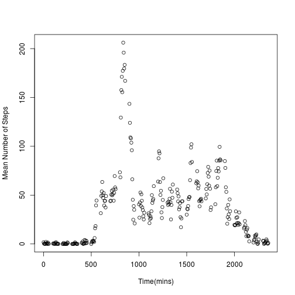
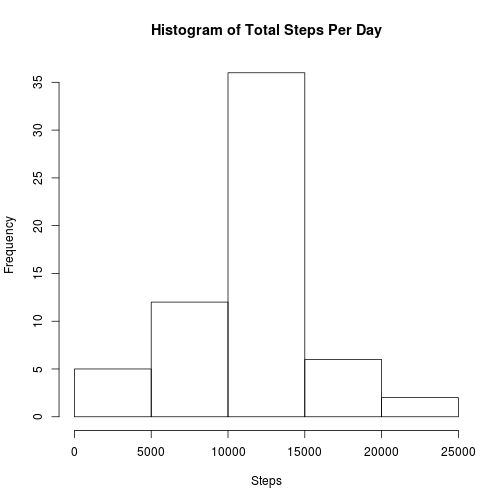
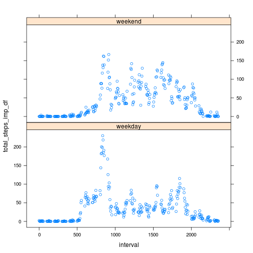

## Loading and preprocessing the data


```r
activity <- read.csv("activity.csv")
```

## What is mean total number of steps taken per day?


```r
#summing steps taken per day

total_steps <- tapply(activity$steps,activity$date,sum) 
total_steps 
```

```
## 2012-10-01 2012-10-02 2012-10-03 2012-10-04 2012-10-05 2012-10-06 
##         NA        126      11352      12116      13294      15420 
## 2012-10-07 2012-10-08 2012-10-09 2012-10-10 2012-10-11 2012-10-12 
##      11015         NA      12811       9900      10304      17382 
## 2012-10-13 2012-10-14 2012-10-15 2012-10-16 2012-10-17 2012-10-18 
##      12426      15098      10139      15084      13452      10056 
## 2012-10-19 2012-10-20 2012-10-21 2012-10-22 2012-10-23 2012-10-24 
##      11829      10395       8821      13460       8918       8355 
## 2012-10-25 2012-10-26 2012-10-27 2012-10-28 2012-10-29 2012-10-30 
##       2492       6778      10119      11458       5018       9819 
## 2012-10-31 2012-11-01 2012-11-02 2012-11-03 2012-11-04 2012-11-05 
##      15414         NA      10600      10571         NA      10439 
## 2012-11-06 2012-11-07 2012-11-08 2012-11-09 2012-11-10 2012-11-11 
##       8334      12883       3219         NA         NA      12608 
## 2012-11-12 2012-11-13 2012-11-14 2012-11-15 2012-11-16 2012-11-17 
##      10765       7336         NA         41       5441      14339 
## 2012-11-18 2012-11-19 2012-11-20 2012-11-21 2012-11-22 2012-11-23 
##      15110       8841       4472      12787      20427      21194 
## 2012-11-24 2012-11-25 2012-11-26 2012-11-27 2012-11-28 2012-11-29 
##      14478      11834      11162      13646      10183       7047 
## 2012-11-30 
##         NA
```

```r
hist(total_steps, main = "Histogram of Total Steps Per Day", xlab="Steps", ylab="Frequency")
```

 

```r
steps_mean <- mean(total_steps,na.rm=TRUE)
steps_mean
```

```
## [1] 10766.19
```

```r
steps_median <- median(total_steps,na.rm=TRUE)
steps_median
```

```
## [1] 10765
```
The mean is 1.0766189 &times; 10<sup>4</sup> the median is 10765
## What is the average daily activity pattern?


```r
# finding mean over interval without NAs
mean_interval <- tapply(activity$steps,activity$interval,mean,na.rm = TRUE)
plot(as.numeric(names(mean_interval)),mean_interval,xlab="Time(mins)",ylab="Mean Number of Steps")
```

 

```r
# Finding interval where max occurs
mean_interval[which(mean_interval==max(mean_interval), arr.ind=TRUE)]
```

```
##      835 
## 206.1698
```

## Imputing missing values


```r
summary(activity)
```

```
##      steps                date          interval     
##  Min.   :  0.00   2012-10-01:  288   Min.   :   0.0  
##  1st Qu.:  0.00   2012-10-02:  288   1st Qu.: 588.8  
##  Median :  0.00   2012-10-03:  288   Median :1177.5  
##  Mean   : 37.38   2012-10-04:  288   Mean   :1177.5  
##  3rd Qu.: 12.00   2012-10-05:  288   3rd Qu.:1766.2  
##  Max.   :806.00   2012-10-06:  288   Max.   :2355.0  
##  NA's   :2304     (Other)   :15840
```

```r
# Indexing NAs
na_index <- which(activity$steps %in% NA)   
# Repeating mean interval for each day
ext_mean_interval <- rep(mean_interval,nlevels(activity$date))    
#picking intervals with NAs
ext_mean_interval <- ext_mean_interval[na_index]     
activity_imp <- activity
# replacing NAs with mean for interval
activity_imp$steps <- replace(activity$steps,na_index,ext_mean_interval)   
total_steps_imp <- tapply(activity_imp$steps,activity_imp$date,sum)
hist(total_steps_imp, main = "Histogram of Total Steps Per Day", xlab="Steps", ylab="Frequency")
```

 

```r
steps_mean_imp <- mean(total_steps_imp)
steps_mean_imp
```

```
## [1] 10766.19
```

```r
steps_median_imp <- median(total_steps_imp)
steps_median_imp
```

```
## [1] 10766.19
```

## Are there differences in activity patterns between weekdays and weekends?


```r
# Finding weekday names
Day <- weekdays(strptime(activity_imp$date,format="%Y-%m-%d"))
# Indexing weekdays and weekends
weekday_index <- c(which(Day %in% "Monday"),which(Day %in% "Tuesday"),which(Day %in% "Wednesday"),which(Day %in% "Thursday"),which(Day %in% "Friday")) # finding index of weekdays
weekend_index <- c(which(Day %in% "Saturday"),which(Day %in% "Sunday")) 
# Adding weekday/weekend factor to dataframe
Day[weekday_index] <- "weekday"
Day[weekend_index] <- "weekend"
Day <- as.factor(Day)
activity_imp$Day <- Day
# Finding means using 5min interval and weekday/weekend factor
total_steps_imp <- tapply(activity_imp$steps,list(activity_imp$interval,activity_imp$Day),mean)
# Constructing data frame for plotting
interval <- as.numeric(row.names(total_steps_imp))
total_steps_imp_df <- c(total_steps_imp[,1],total_steps_imp[,2])
Day2 <- c(rep("weekday",length(total_steps_imp[,2])),rep("weekend",length(total_steps_imp[,2])))
plot_df <- data.frame(interval,total_steps_imp_df,Day2)
library(lattice)
xyplot(total_steps_imp_df ~ interval | Day2, data = plot_df, layout = c(1,2))
```

 
